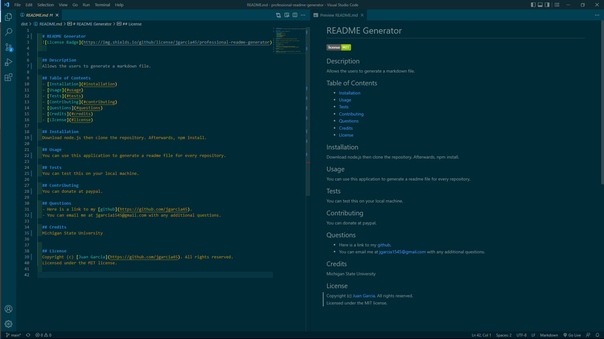

# Node.js Challenge: Professional README Generator
[](https://bootcamp.msu.edu/)

## Technologies


## Description
Our task is to create a command-line application that dynamnically generates a professional README.md file from a user's input. I will be using node.js and the [Inquirer Package](https://www.npmjs.com/package/inquirer) within the application. We are using this [Professional README Guide](https://coding-boot-camp.github.io/full-stack/github/professional-readme-guide) as a guide to generate the README file. The application will be invoked by using the following command:
```
node index.js
```
## Installation
***Requirments***

[Node.js](https://nodejs.org/en/)

***Once Installed:***
1. Clone the Repository on to your machine.
2. Open the terminal and ensure you are in the right file path.
3. Run the command ```npm install``` to download the packages.
4. Then run the command ```node index.js``` to run the software.
5. The readme file is saved under the ```dist``` folder.

## User Story
```
AS A developer
I WANT a README generator
SO THAT I can quickly create a professional README for a new project
```

## Acceptance Criteria
```
GIVEN a command-line application that accepts user input
WHEN I am prompted for information about my application repository
THEN a high-quality, professional README.md is generated with the title of my project and sections entitled Description, Table of Contents, Installation, Usage, License, Contributing, Tests, and Questions
WHEN I enter my project title
THEN this is displayed as the title of the README
WHEN I enter a description, installation instructions, usage information, contribution guidelines, and test instructions
THEN this information is added to the sections of the README entitled Description, Installation, Usage, Contributing, and Tests
WHEN I choose a license for my application from a list of options
THEN a badge for that license is added near the top of the README and a notice is added to the section of the README entitled License that explains which license the application is covered under
WHEN I enter my GitHub username
THEN this is added to the section of the README entitled Questions, with a link to my GitHub profile
WHEN I enter my email address
THEN this is added to the section of the README entitled Questions, with instructions on how to reach me with additional questions
WHEN I click on the links in the Table of Contents
THEN I am taken to the corresponding section of the README
```

## Screenshot
The screenshot shows the output of the markdown file that is generated.


## Video
A link to the [Video](https://watch.screencastify.com/v/bdMPxYeGCbiDyQGm4E1j):

## Link
A link to the [code](https://github.com/jgarcia45/professional-readme-generator):
```
https://github.com/jgarcia45/professional-readme-generator
```